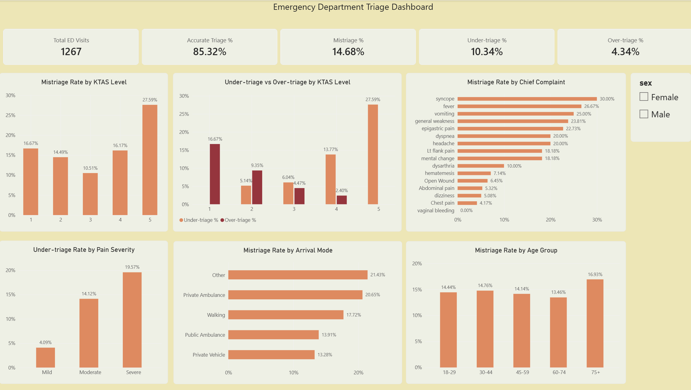

# Emergency Department Triage Quality Improvement Analysis

A healthcare quality improvement and data analytics project examining emergency department triage accuracy, mistriage patterns, and potential areas for patient-safety improvement.

The project uses **Excel, PostgreSQL, SQL, and Power BI** to move from raw healthcare data to an analysis-ready dataset, exploratory analysis, and an interactive dashboard.

---

## Project Overview

Emergency department triage determines how urgently a patient should receive care.

This project compares the triage level assigned by the triage nurse with the expert assessment and evaluates:

- Accurate triage
- Under-triage
- Over-triage
- KTAS-level patterns
- Pain severity
- Chief complaint
- Arrival mode
- Age group
- Potential causes of mistriage

The objective was to identify patterns that may help prioritize quality-improvement initiatives and improve patient safety.

---

## Key Performance Indicators

| KPI | Result |
|---|---:|
| Total ED Visits | 1,267 |
| Accurate Triage | 85.32% |
| Overall Mistriage | 14.68% |
| Under-triage | 10.34% |
| Over-triage | 4.34% |

---

## Key Findings

### KTAS Level

KTAS 5 had the highest mistriage rate at **27.59%**.

KTAS 4 generated the largest number of mistriage cases because it contained a much larger patient volume.

Under-triage was especially concentrated in KTAS 4 and KTAS 5.

### Pain Severity

Under-triage increased as pain severity increased:

- Mild pain: **4.09%**
- Moderate pain: **14.12%**
- Severe pain: **19.57%**

This suggests that pain severity assessment is an important area for further quality-improvement review.

### Chief Complaint

Among chief complaints with at least 10 observations, higher mistriage rates were observed for:

- Syncope: **30.00%**
- Fever: **26.67%**
- Vomiting: **25.00%**
- General weakness: **23.81%**
- Epigastric pain: **22.73%**
- Dyspnea: **20.00%**
- Headache: **20.00%**

Chief complaint labels were standardized before analysis to reduce fragmented categories.

### Age

Mistriage rates were relatively similar across most age groups.

Patients aged **75+** had the highest observed rate at **16.93%**.

---

## Data Quality

Practical data-quality checks were performed before analysis, including:

- Record-count validation
- Missing-value checks
- Duplicate detection
- Identification of an accidentally imported CSV header
- Validation of key analytical fields
- Standardization of selected chief complaint labels
- Conversion of coded fields into analysis-ready categories

The raw source table was preserved, while an analytical SQL view was created for reporting.

---

## SQL Techniques Used

The SQL analysis includes:

- `GROUP BY`
- `CASE WHEN`
- Aggregate functions
- `FILTER`
- Common Table Expressions (`CTE`)
- Window functions
- Cumulative percentages
- Data standardization
- Analytical view creation

---

## Power BI Dashboard

The final dashboard includes:

- Total ED Visits
- Accurate Triage %
- Mistriage %
- Under-triage %
- Over-triage %
- Mistriage Rate by KTAS Level
- Under-triage vs Over-triage by KTAS Level
- Under-triage Rate by Pain Severity
- Mistriage Rate by Chief Complaint
- Mistriage Rate by Arrival Mode
- Mistriage Rate by Age Group
- Interactive sex filter



---

## Technology Stack

- **PostgreSQL**
- **SQL**
- **Power BI**
- **Excel**
- **GitHub**
- Healthcare Quality Improvement methods

---

## Repository Structure

```text
ED-Triage-QI-Analysis/
│
├── README.md
│
├── sql/
│   ├── 01_data_quality.sql
│   ├── 02_exploratory_analysis.sql
│   └── 03_create_analytics_view.sql
│
├── powerbi/
│   └── ED_Triage_QI_Dashboard.pbix
│
├── images/
│   └── dashboard.png
│
└── docs/
    └── data_dictionary.md
